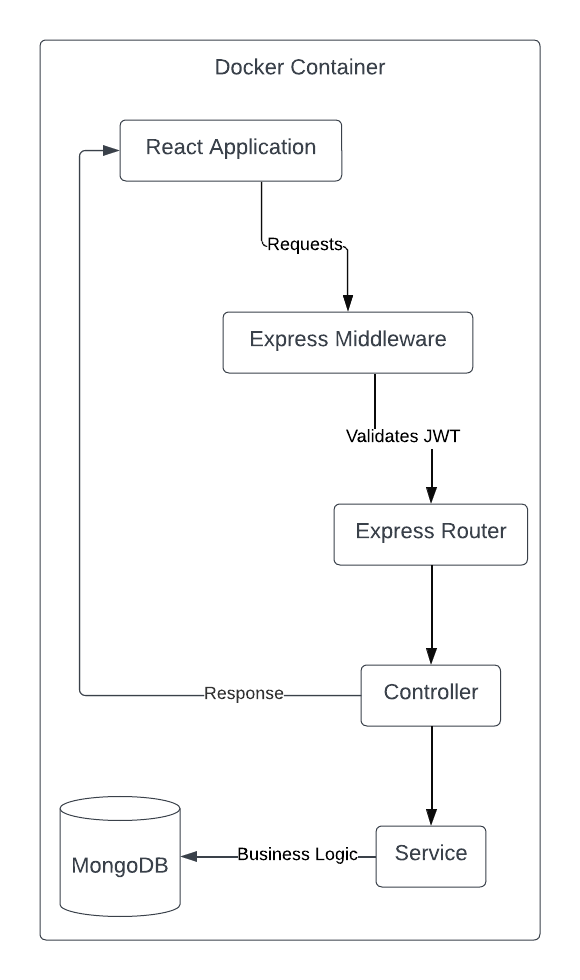

# PawMate Monorepo

This repository contains the code for a full-stack application, including a React-based frontend and an Express-based backend. Docker Compose is used to containerize and run both parts of the application together, ensuring a seamless development environment.

## Project Folder Structure

- `/backend`: Contains the Express application.
- `/frontend`: Contains the React application.
- `docker-compose.yml`: Docker Compose configuration file to build and run the backend and frontend services.

## Project Infrastructure



## Technologies

- **Backend**: Node.js with Express
- **Frontend**: React
- **Containerization**: Docker and Docker Compose
- **Data**: MongoDB

## Getting Started

### Live Demo URL
We have deployed the application on a live server for testing purposes. You can access the application at the following URL:

[pawmate.zapto.org](https://pawmate.zapto.org/)

### Prerequisites

In case you want to run the application locally, you will need the following tools:

- Docker and Docker Compose installed on your machine.
- Node.js and npm installed if you plan to run or test locally without Docker.

### Running the Application with Docker Compose

1. **Clone the Repository**

   ```sh
   git clone UOA-CS732-SE750-Students-2024/project-group-whimsical-wallabies.git
   cd project-group-whimsical-wallabies
   ```
2. **Install the Dependencies**

   - **Frontend:** [Follow these steps to install frontend dependencies](https://github.com/UOA-CS732-SE750-Students-2024/project-group-whimsical-wallabies?tab=readme-ov-file#install-dependencies-1)
   - **Backend:** [Follow these steps to install backend dependencies](https://github.com/UOA-CS732-SE750-Students-2024/project-group-whimsical-wallabies#install-dependencies)

3. **Environment Setup**

   - **Frontend:** [Configure the frontend environment](https://github.com/UOA-CS732-SE750-Students-2024/project-group-whimsical-wallabies?tab=readme-ov-file#environment-setup-1)
   - **Backend:** [Configure the backend environment](https://github.com/UOA-CS732-SE750-Students-2024/project-group-whimsical-wallabies?tab=readme-ov-file#environment-setup)

4. **Build and Start Docker Containers**
Build the Docker images and start the services using Docker Compose from the root of the project:
   ```sh
   docker-compose up --build
   ```
This command builds the Docker images for the backend and frontend services, and starts the containers. The --build flag forces a rebuild of the images to incorporate any new changes.

5. **Initial Mock Data Setup**
Build the Docker images and start the services using Docker Compose from the root of the project:
   - **Mock Data Setup**: [Initialize the mock data](https://github.com/UOA-CS732-SE750-Students-2024/project-group-whimsical-wallabies?tab=readme-ov-file#initial-mock-data-setup)

6. **Access the Application**

   - **Frontend:** Access the frontend at [http://localhost:3000](http://localhost:3000)
   - **Backend:** Access the backend at [http://localhost:3001](http://localhost:3001)

## Development Environment

The Docker Compose file is configured with development in mind, featuring hot reloading for both frontend and backend. Modifications in the source code will be reflected in the running containers without needing a rebuild.

## Docker Compose Configuration

- **Backend Service:** Exposed on port 3001, with volume mappings for live code updates.
- **Frontend Service:** Exposed on port 3000, depends on the backend service, and is configured for hot reloading.

## Dependencies

### Backend

- **express:** Web server framework.
- **dotenv:** Loads environment variables from a `.env` file.

#### Install Dependencies:
Navigate to the frontend directory:
   ```sh
   cd backend
   ```

Install the dependencies:
   ```sh
   npm install
   ```

#### Development Dependencies:

- **eslint:** Lints and fixes JS code.
- **prettier:** Code formatter.
- **nodemon:** Automatically restarts the node application when file changes are detected.

#### Environment Setup:

Create a `.env` file in the root of the backend directory and add the following lines:
   ```sh
   PORT=3001
   MONGO_URI=mongodb://mongo:27017/732-project
   JWT_SECRET=your_jwt_secret
   OPEN_WEATHER_API_KEY=your_open_weather_api_key
   OPEN_WEATHER_URL=http://api.openweathermap.org/data/2.5/weather
   OPENAI_API_KEY=your_openai_api_key
   APP_GOOGLE_MAPS_API_KEY=your_google_map_api_key
   ```

### Frontend

- **react, react-dom:** Core React libraries.
- **react-scripts:** Includes scripts and configuration used by Create React App.

#### Install Dependencies:
Navigate to the frontend directory:
   ```sh
   cd frontend
   ```

Install the dependencies:
   ```sh
   npm install
   ```

#### Development Dependencies:

- **eslint:** Lints JS and JSX files.
- **prettier:** Code formatter.

#### Environment Setup:

Create a `.env` file in the root of the frontend directory and add the following line:
```sh
REACT_APP_API_URL=http://localhost:3001
REACT_APP_GOOGLE_MAPS_API_KEY=your_google_map_api_key
```
This variable points to the URL of the backend server.

## Initial Mock Data Setup

### Step 1: Navigate to the Backend Directory
To start, navigate to the backend directory by executing the following command in your terminal:
```sh
cd backend
```
### Step 2: Run the Data Seeding Script
Next, initialize the mock data by running the data seeding script. This script populates your database with sample data essential for development:
```sh
node .\src\seedingData.js
```
These steps will ensure that your development environment is pre-populated with the necessary mock data to begin testing and development immediately.

The following predefined user accounts are available for testing purposes:

| Username     | Password |
|--------------|----------|
| doglover1    | password1|
| puppyfanatic | password2|
| caninelover  | password3|
| woofwoof     | password4|
| barkbuddy    | password5|

These steps will ensure that your development environment is pre-populated with the necessary mock data to begin testing and development immediately.

## Code Style and Guidelines

We enforce a strict coding style to maintain the quality and consistency of our codebase. Using tools like **Husky**, **Lint-staged**, **ESLint**, and **Prettier**, we ensure that every piece of code is checked for style violations and formatted correctly before it is committed.

- **Husky** manages pre-commit hooks to run necessary scripts.
- **Lint-staged** focuses on staged files to prevent errors before committing.
- **ESLint** enforces a consistent coding style and detects code issues.
- **Prettier** automatically formats our code for readability and consistency.

For detailed guidelines, configurations, and more information, please refer to our [Project Wiki](https://github.com/UOA-CS732-SE750-Students-2024/project-group-whimsical-wallabies/wiki/07.-Code-Style-and-Guidelines).

## Contribution Guidelines

Contributing to our project is straightforward. Here's a brief overview of the process:

1. **Find an Issue**: Visit our project on Jira to find and select an issue that matches your skills.
2. **Fork & Clone**: Fork the repository on GitHub and clone it locally to start making changes.
3. **Commit & Push**: Work on your changes in a new branch, commit them, and push the branch to your fork.
4. **Create a Pull Request**: Submit a pull request to the main repository for review.

For a detailed step-by-step guide on how to contribute, please refer to our [project wiki](https://github.com/UOA-CS732-SE750-Students-2024/project-group-whimsical-wallabies/wiki/11.-Contribution-Guidlines)


## Project Documentation

Welcome to the PawMate App, a MERN stack application for connecting dog owners. Below is a summary of the resources available in our project wiki:

01. [Introduction](https://github.com/UOA-CS732-SE750-Students-2024/project-group-whimsical-wallabies/wiki/01.-Introduction): Overview of the project and its objectives.
02. [Getting Started](https://github.com/UOA-CS732-SE750-Students-2024/project-group-whimsical-wallabies/wiki/02.-Getting-Started): Steps to get up and running with the application.
03. [System Requirements](https://github.com/UOA-CS732-SE750-Students-2024/project-group-whimsical-wallabies/wiki/03.-System-Requirements): Hardware and software needed to use and develop the app.
04. [Installation Guide](https://github.com/UOA-CS732-SE750-Students-2024/project-group-whimsical-wallabies/wiki/04.-Installation-Guide): Detailed instructions for setting up the application.
05. [Feature Documentation](https://github.com/UOA-CS732-SE750-Students-2024/project-group-whimsical-wallabies/wiki/05.-Feature-Documentation): In-depth coverage of the application's features.
06. [User Manual](https://github.com/UOA-CS732-SE750-Students-2024/project-group-whimsical-wallabies/wiki/06.-User-Manual): Instructions for end-users on how to use the application.
07. [API Documentation](https://github.com/UOA-CS732-SE750-Students-2024/project-group-whimsical-wallabies/wiki/07.-API-Documentation): Information on the application's APIs and how to use them.
08. [Code Style and Guidelines](https://github.com/UOA-CS732-SE750-Students-2024/project-group-whimsical-wallabies/wiki/08.-Code-Style-and-Guidelines): Coding standards and practices to follow.
09. [Testing](https://github.com/UOA-CS732-SE750-Students-2024/project-group-whimsical-wallabies/wiki/09.-Testing): Testing strategies and frameworks used.
10. [Deployment](https://github.com/UOA-CS732-SE750-Students-2024/project-group-whimsical-wallabies/wiki/10.-Deployment): Guidelines for deploying the application.
11. [Contribution Guidelines](https://github.com/UOA-CS732-SE750-Students-2024/project-group-whimsical-wallabies/wiki/11.-Contribution-Guidlines): Information on how to contribute to the project.
12. [Credits and Acknowledgements](https://github.com/UOA-CS732-SE750-Students-2024/project-group-whimsical-wallabies/wiki/12.-Credits-and-Acknowledgements): Recognition of those who have contributed to the project.
13. [Project Management](https://github.com/UOA-CS732-SE750-Students-2024/project-group-whimsical-wallabies/wiki/13.-Project-Manageemnt): Oversight of the project, including meeting minutes and decision-making.

For detailed documentation, visit our [Project Wiki Link](https://github.com/UOA-CS732-SE750-Students-2024/project-group-whimsical-wallabies/wiki)
